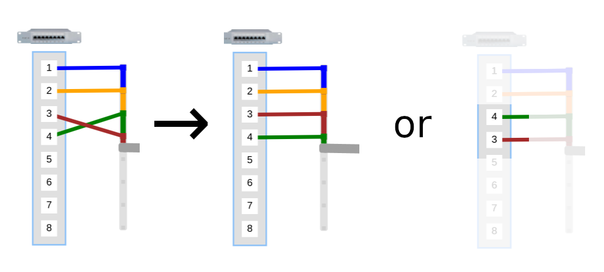

# FreeOptic - IDE for creating fiber-optic schemes

Online demo https://all-optic.com/

## Installation

```
docker compose build
docker compose up
```

Create a superuser with name=admin and password=12345:
```
docker exec -it freeoptic perl install.pl -p admin=12345
```

### Comments

You can change some settings in docker-compose.yml. Db directory on your host machine is freeoptic/data/mysql:

```
    volumes:
      - ./data/mysql:/var/lib/mysql
```

Www port on your host machine is 8080:

```
    ports:
      - "8080:80"
```

## Work
Open in browser
```
http://127.0.0.1:8080/cgi-bin/stat.pl
```

- Double-click or right-click in an empty space to display scheme elements creation menu


- Unconnected fibers are not displayed. To display them, switch into "link creation mode".
In this mode you can draw connections between fiber edges of cable and connectors. You can also link connectors with a patch cord


- You can change fiber ordering or connector ordering. Drag the fiber edge or the connector




- You can change cable position or cable path. Right click on a cable and select "create a joint". Left click on a joint and move it.


- You can group items in a container. First create a container. Then use drag and drop


- You can set names and descriptions for all objects. For example splitter 10%-90% 


- Undo/redo buttons () and history button () allow you to rewind actions forward and backward


- A scheme may contain thousands of objects. At a large scale they will be shown schematically. When zoomed in, the objects will be shown in full


- Color presets for fibers


- Multimode fiber cable


- Path tracing between two points. It also calculates the total length of cables along the path. Right click on a connector, select "start path point" and then "end path point". Right click on an empty space of the scheme and select "path"


- Bookmarks remember position and scale of a scheme fragment


- Scheme data
  - Tags can be assigned to objects on the scheme. Using  button, you can show objects with specified tags
  - A scheme may show some data (for example rx or tx) received from another database. For example, this may be a database in which you record ONU signal levels online.


